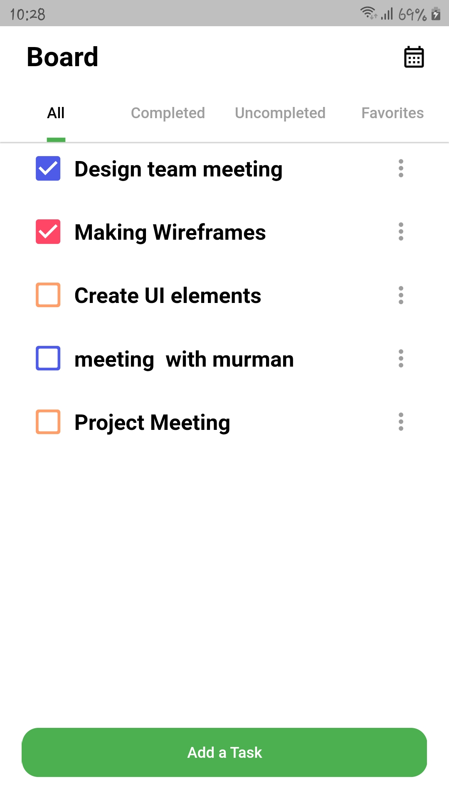
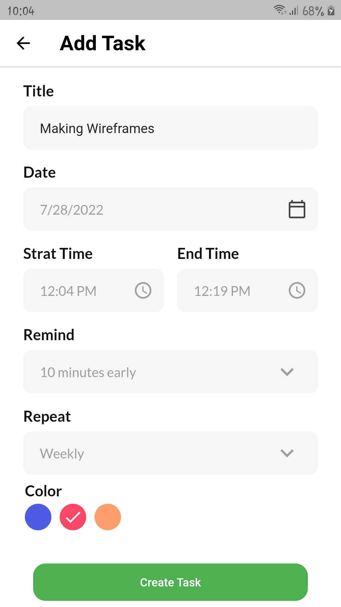
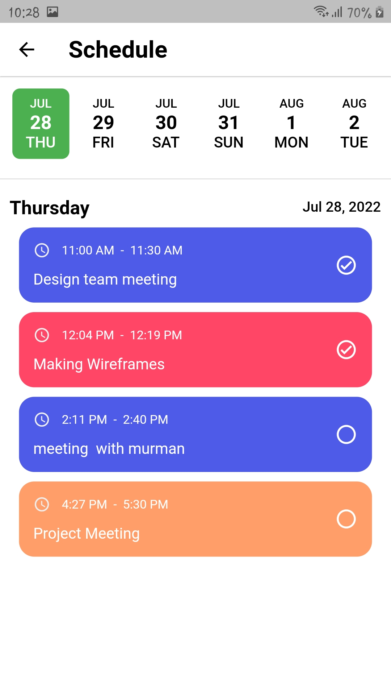

# todo_app

A new Flutter project.

# Screenshots:

<h3> 1- Home screen </h3> 

  

<h3> 2- Create task screen </h3>

  

<h3> 3- Schedule screen </h3>

  

<h3> 3- Screen Recorder </h3>
https://user-images.githubusercontent.com/89175507/181472037-99aed7ae-2ed6-4a8b-a3a7-ab4dfa848298.mp4

## Getting Started

This project is a starting point for a Flutter application.

A few resources to get you started if this is your first Flutter project:

- [Lab: Write your first Flutter app](https://docs.flutter.dev/get-started/codelab)
- [Cookbook: Useful Flutter samples](https://docs.flutter.dev/cookbook)

For help getting started with Flutter development, view the
[online documentation](https://docs.flutter.dev/), which offers tutorials,
samples, guidance on mobile development, and a full API reference.
